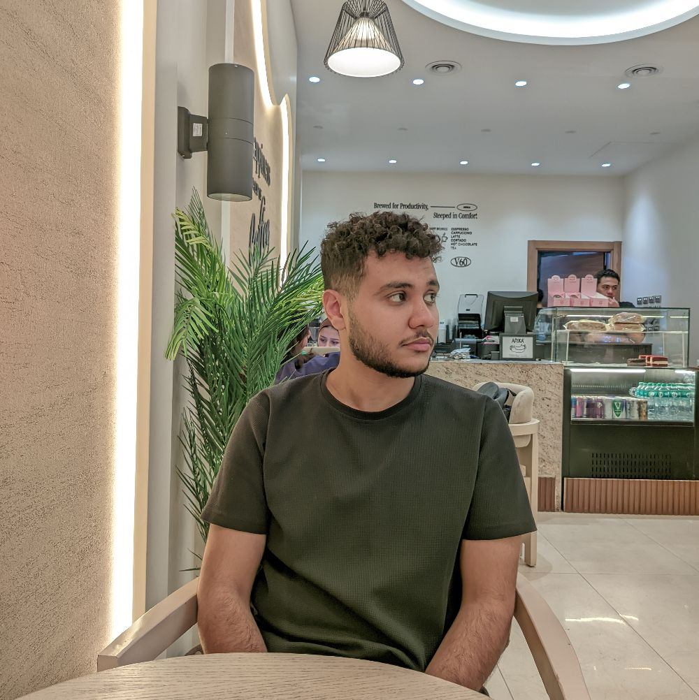

<h1 align="center" style="color: #00f0ff;">Hi, I'm Yousef Mohamed 👋</h1>
<h3 align="center">Full Stack Web Developer & Computer Science Student</h3>

 

<table width="100%" style="border: none; border-collapse: collapse;">
  <tr>
    <td width="70%" valign="top" style="border: none; padding-right: 20px;">
      <h2>About Me</h2>
      

        I am a 3rd-year <b>Computer Science</b> student at a leading Egyptian university, specializing in <b>Full Stack Development</b>. My journey is driven by a deep curiosity for building efficient, user-centric, and scalable web solutions.
      

      

        My expertise spans the entire development lifecycle, from architecting robust database systems and secure APIs to crafting intuitive and modern frontend interfaces.
      

    </td>
    <td width="30%" align="center" valign="middle" style="border: none;">
      
    </td>
  </tr>
</table>

 

<h2>My Services</h2>
<ul>
  <li>💻 <b>Front-End Development:</b> HTML, CSS, React.js, Tailwind</li>
  <li>🗄️ <b>Back-End & APIs:</b> PHP, Laravel, MySQL</li>
  <li>⚙️ <b>WordPress Solutions:</b> Custom sites for businesses and agencies</li>
</ul>

 

<h2 align="center">Skills Stack</h2>

  
  
  
  
  
  
  
  

 

<h2 align="center">Let's Work Together</h2>

    
    
    

